# ContractEx — Architecture Reference

This document provides a complete technical reference for the ContractEx library: module responsibilities, data models, execution flows, extension points, and design decisions. It is intended for developers building on top of the library or contributing to it.

---

## Contents

- [Design principles](#design-principles)
- [Layer diagram](#layer-diagram)
- [Module responsibilities](#module-responsibilities)
- [Data models](#data-models)
- [Execution flows](#execution-flows)
  - [Contract extraction (existing pipeline)](#contract-extraction-existing-pipeline)
  - [General legal document pipeline (new)](#general-legal-document-pipeline-new)
  - [Network ingestion with change detection](#network-ingestion-with-change-detection)
- [Extension points](#extension-points)
- [Error handling strategy](#error-handling-strategy)
- [Testing strategy](#testing-strategy)
- [Dependency matrix](#dependency-matrix)

---

## Design principles

1. **Composable over monolithic.** Every layer exposes an abstract base class. Callers swap implementations without touching downstream code.
2. **Provenance first.** Every extracted value can be traced to its exact source location. This is non-negotiable for legal work.
3. **Confidence is a first-class citizen.** Extraction outputs carry per-field confidence scores. The routing layer acts on those scores — it never silently accepts low-confidence values.
4. **Compliance-grade audit trail.** Every material operation is logged to an append-only, structured record. Backend failures never interrupt the pipeline.
5. **Testable without infrastructure.** All unit tests run with zero external dependencies. LLM calls are mocked at the provider boundary; network calls are mocked at the requests boundary; database calls are mocked at the psycopg2 boundary.
6. **Fail loudly at the boundary, silently inside.** `DocumentLoadError`, `ExtractionError`, and `LLMProviderError` are raised at the public surface. Internal per-chunk failures are captured as warnings in `ContractMetadata`, never as exceptions.

---

## Layer diagram

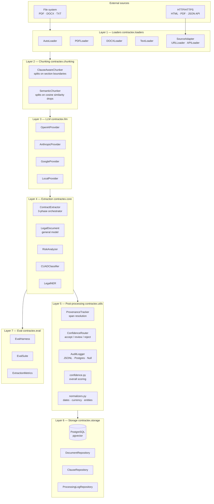

---

## Module responsibilities

### `contractex.loaders`

| Class | Responsibility |
| --- | --- |
| `DocumentLoader` | ABC: `load(source) -> str`, `load_with_metadata()`, `supports()` |
| `AutoLoader` | Dispatches to the right loader by file extension |
| `PDFLoader` | PyMuPDF extraction; optional OCR via pytesseract |
| `DOCXLoader` | python-docx paragraph extraction |
| `TextLoader` | UTF-8 / Latin-1 plain text with encoding detection |
| `SourceAdapter` | Extends `DocumentLoader` with `fetch(source, cache)`, `changed_since()`, exponential-backoff `_retry()` |
| `URLLoader` | HTTP/HTTPS fetch; HTML stripping via stdlib `html.parser`; PDF delegation to PyMuPDF; conditional GET |
| `APILoader` | JSON REST API; dot-path text extraction; pagination via Link header or `next` key |

**Key design:** `SourceAdapter.load()` delegates to `fetch()` so network loaders are drop-in replacements anywhere a `DocumentLoader` is accepted.

### `contractex.chunking`

| Class | Strategy |
| --- | --- |
| `ClauseAwareChunker` | Splits on legal structural markers (numbered sections, `WHEREAS`, `NOW THEREFORE`). Preserves clause boundaries — critical for extraction accuracy. |
| `SemanticChunker` | Splits where cosine similarity between adjacent sentences drops below a threshold. Requires an embedding model. |

Both implement `ChunkingStrategy.chunk(text: str) -> list[str]`.

### `contractex.llm`

All providers implement `LLMProvider`:

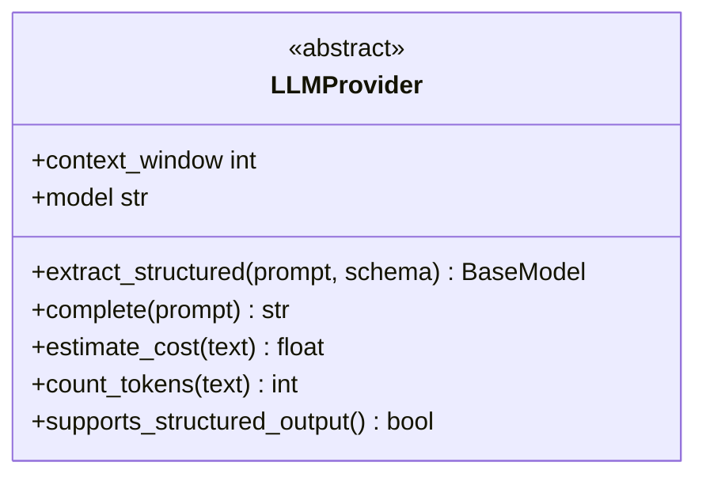

`extract_structured` is the workhorse: it sends a prompt and a Pydantic schema and returns a validated model instance. Internally each provider uses the native structured-output mechanism (OpenAI function calling, Anthropic tool use, Gemini JSON mode, Ollama JSON mode).

### `contractex.core`

#### `ContractExtractor`

Three-phase orchestrator:

1. **Phase 1** — contract info + parties from the document preamble (first 12,000 chars)
2. **Phase 2** — clause + financial extraction per chunk, run in parallel via `ThreadPoolExecutor`
3. **Phase 3** — deduplication: containment check then `SequenceMatcher` ratio ≥ 0.90 for near-duplicates

#### `LegalDocument`

General-purpose extraction model for any legal document type. Key fields:

- `extracted_fields: dict[str, Any]` — schema-agnostic extracted values
- `field_confidences: dict[str, float]` — mirrors `extracted_fields`
- `provenance: dict[str, SourceSpan]` — populated by `ProvenanceTracker`
- `provenance_coverage` property — fraction of fields with a span

#### `RiskAnalyzer`

Hybrid approach: keyword rule engine for known high-risk patterns (unlimited liability, auto-renewal, unilateral amendment) plus LLM-based analysis for nuanced risks. Results merged and deduplicated.

#### `CUADClassifier`

Maps clause text to one of 41 CUAD (Contract Understanding Atticus Dataset) clause types. Used in the extraction prompt templates to constrain LLM output to known taxonomy.

### `contractex.utils`

#### `ProvenanceTracker`

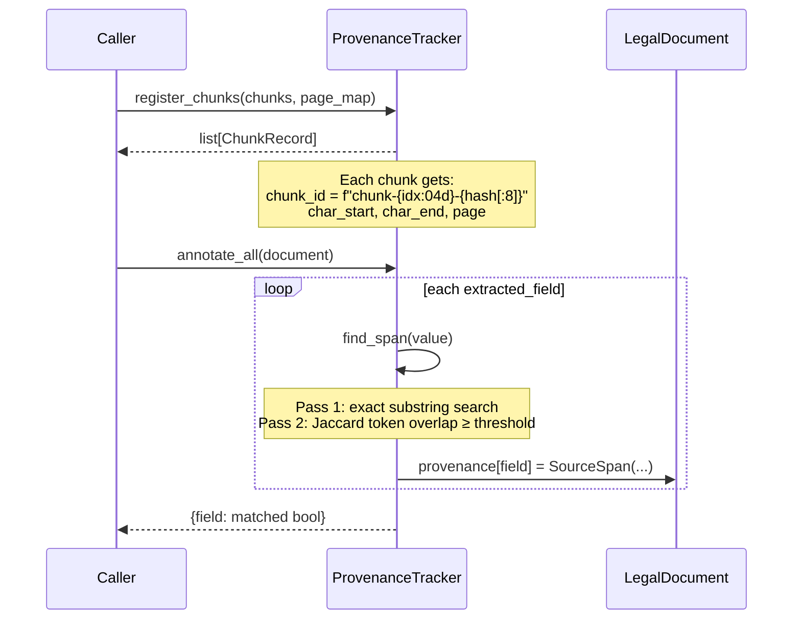

#### `ConfidenceRouter`

Decision logic per field:

```
confidence ≥ accept_threshold  →  AUTO_ACCEPT
reject_threshold ≤ confidence < accept_threshold  →  HUMAN_REVIEW
confidence < reject_threshold  →  AUTO_REJECT
```

Per-field overrides in `field_thresholds` take precedence over global thresholds. The review queue is always sorted by confidence ascending so reviewers see the least-certain items first.

#### `AuditLogger`

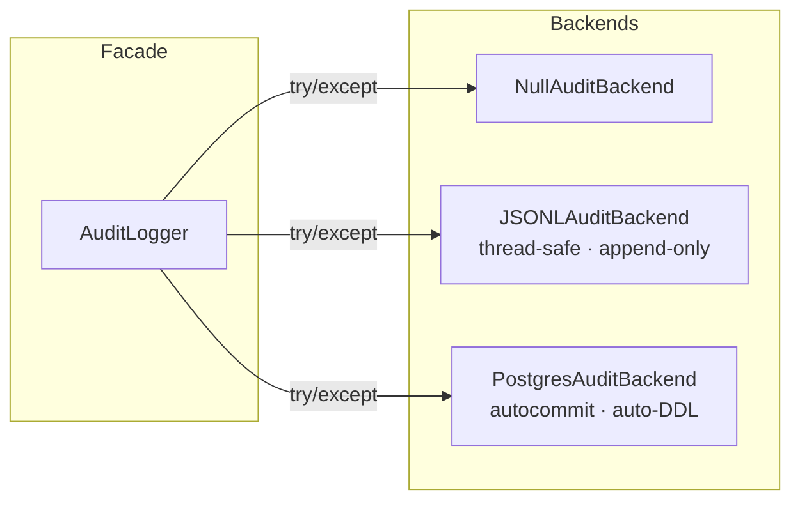

All writes are wrapped in `try/except`. Backend errors are logged via `logging.error()` and swallowed — the pipeline is never interrupted by an audit failure.

### `contractex.eval`

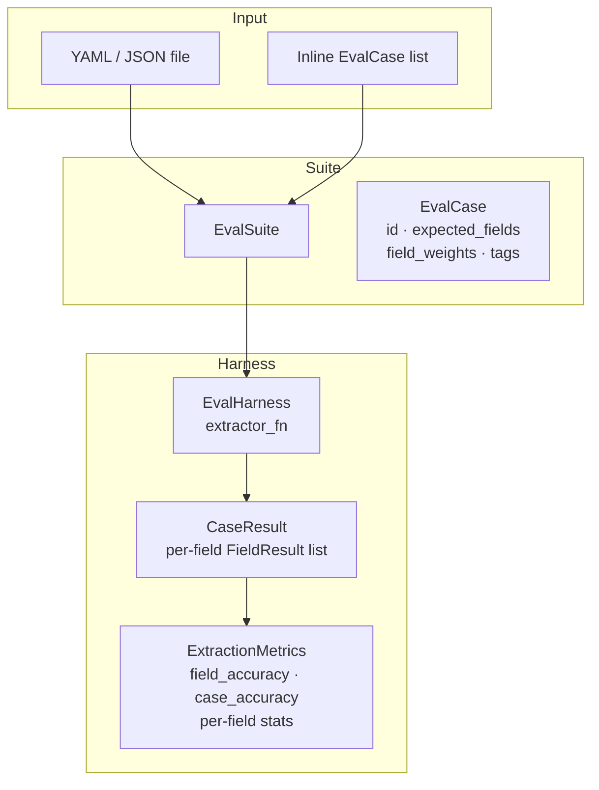

**Weighted field accuracy formula:**

```
field_accuracy = Σ(weight_i × match_i) / Σ(weight_i)
```

This lets suite authors declare that `citation` accuracy matters twice as much as `governing_law` without changing the case structure.

---

## Data models

### Contract extraction models

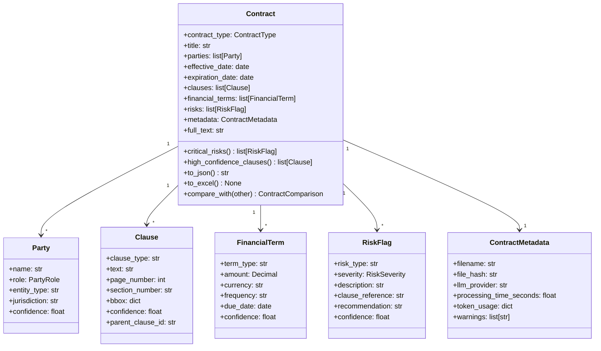

### General legal document models

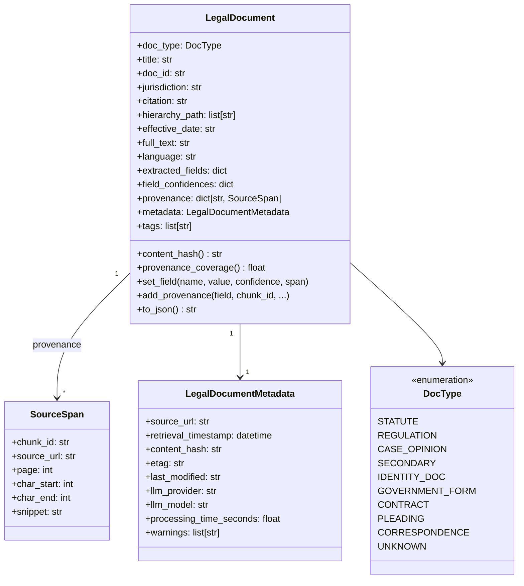

### Routing models

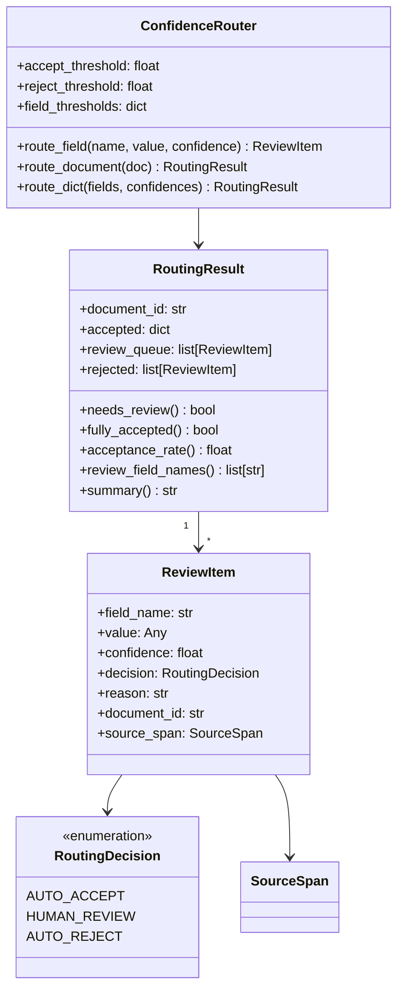

---

## Execution flows

### Contract extraction (existing pipeline)

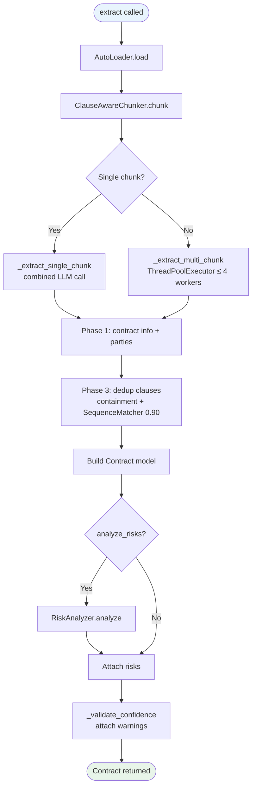

### General legal document pipeline (new)

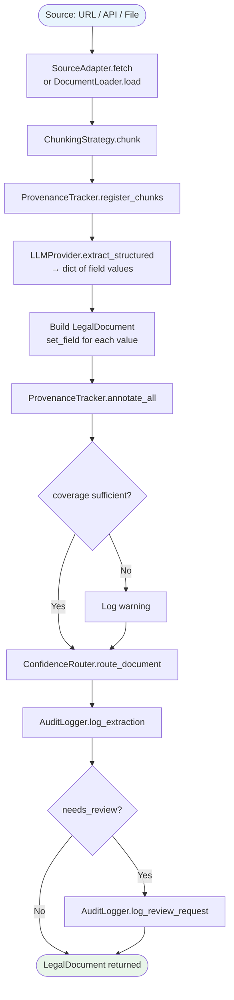

### Network ingestion with change detection

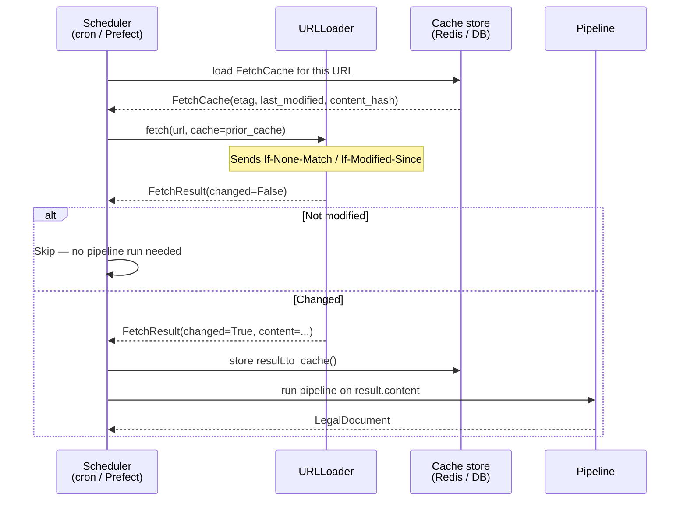

---

## Extension points

### Adding a new LLM provider

Subclass `LLMProvider` and implement five abstract methods:

```python
from contractex.llm.base import LLMProvider

class MyProvider(LLMProvider):
    def extract_structured(self, prompt, schema, temperature=0.0, max_tokens=None):
        # Call your API, parse JSON, return schema(**parsed)
        ...

    def complete(self, prompt, temperature=0.7, max_tokens=None, **kwargs):
        ...

    def estimate_cost(self, text):
        # Return estimated USD cost for this input text
        ...

    def count_tokens(self, text):
        ...

    @property
    def context_window(self):
        return 128_000

    @property
    def model(self):
        return "my-model-id"
```

### Adding a new document loader

Subclass `DocumentLoader` (file-based) or `SourceAdapter` (network-based):

```python
from contractex.loaders.base import DocumentLoader

class S3Loader(DocumentLoader):
    def load(self, source: str) -> str:
        # source = "s3://bucket/key"
        ...

    def supports(self, file_path: str) -> bool:
        return file_path.startswith("s3://")
```

Register in `AutoLoader` or pass directly to `ContractExtractor`.

### Adding a new chunking strategy

Subclass `ChunkingStrategy`:

```python
from contractex.chunking.base import ChunkingStrategy

class SentenceChunker(ChunkingStrategy):
    def chunk(self, text: str) -> list[str]:
        # Split on sentence boundaries
        ...
```

### Adding a new audit backend

Subclass `AuditBackend`:

```python
from contractex.utils.audit import AuditBackend, AuditEvent

class SlackAuditBackend(AuditBackend):
    def write(self, event: AuditEvent) -> None:
        if event.event_type.value in ("pipeline_error", "review_requested"):
            self._post_to_slack(event)

    def close(self) -> None:
        pass
```

### Adding extraction schemas for a new document type

Add a Pydantic model for the document-type-specific fields and populate `LegalDocument.extracted_fields` from it:

```python
from pydantic import BaseModel
from contractex.core.legal_document import LegalDocument, DocType

class PassportData(BaseModel):
    surname: str
    given_name: str
    nationality: str
    passport_number: str
    date_of_birth: str
    expiry_date: str
    mrz_line1: str
    mrz_line2: str
    mrz_valid: bool

# After LLM extraction:
passport = llm.extract_structured(prompt, PassportData)
doc = LegalDocument(doc_type=DocType.IDENTITY_DOC)
for field, value in passport.model_dump().items():
    doc.set_field(field, value, confidence=field_confidences[field])
```

---

## Error handling strategy

```mermaid
graph TD
    subgraph Public surface
        E1[DocumentLoadError<br/>raised on load failure]
        E2[ExtractionError<br/>raised on total pipeline failure]
        E3[LLMProviderError<br/>raised on API error after retries]
    end

    subgraph Internal
        W1[Per-chunk LLM failure<br/>→ warning in ContractMetadata.warnings]
        W2[Low-confidence extraction<br/>→ warning, item kept in output]
        W3[Audit backend failure<br/>→ logging.error, never raised]
        W4[Provenance miss<br/>→ annotate() returns False, field has no span]
    end

    style E1 fill:#ffcdd2
    style E2 fill:#ffcdd2
    style E3 fill:#ffcdd2
    style W1 fill:#fff9c4
    style W2 fill:#fff9c4
    style W3 fill:#fff9c4
    style W4 fill:#fff9c4
```

The rule: **raise at the boundary, warn inside**. A caller gets an exception only when the top-level operation cannot produce any useful output. Everything recoverable is captured as a warning and the pipeline continues.

---

## Testing strategy

| Layer | Test approach | Location |
| --- | --- | --- |
| Loaders (file) | Real temp files via `tmp_path` | `tests/test_smoke.py` |
| SourceAdapter / URLLoader / APILoader | `unittest.mock.patch("requests.get")` | `tests/test_source_adapter.py` |
| LegalDocument | Pure Pydantic model instantiation | `tests/test_legal_document.py` |
| ProvenanceTracker | Pure Python string ops | `tests/test_provenance.py` |
| AuditLogger / backends | JSONL backend writes to `tmp_path`; thread-safety via `threading.Thread` | `tests/test_audit.py` |
| ConfidenceRouter | Pure arithmetic | `tests/test_confidence_router.py` |
| EvalHarness | Stub `extractor_fn` callables | `tests/test_eval_harness.py` |
| ContractExtractor | `unittest.mock` LLM provider | `tests/test_extraction_pipeline.py` |
| Storage (integration) | Real PostgreSQL via `pytest.mark.integration` | `tests/test_repository_integration.py` |

**Rule:** unit tests must run with `pytest -m "not integration" --no-cov` in under 5 seconds on any machine with no external services.

---

## Dependency matrix

| Extra | Packages | Required for |
| --- | --- | --- |
| _(core)_ | pydantic, openai, anthropic, google-generativeai, pymupdf, python-docx, pandas, openpyxl, python-dotenv | All pipelines |
| `network` | requests | URLLoader, APILoader |
| `eval` | pyyaml | EvalSuite.from_yaml() |
| `ocr` | pytesseract, pillow | Scanned PDF extraction |
| `cloud` | azure-ai-formrecognizer, boto3 | Azure DI / AWS Textract |
| `spacy` | spacy | LegalNER |
| `local` | ollama | LocalProvider |
| `storage` | psycopg2-binary | DocumentRepository, AuditLogger Postgres backend |
| `retrieval` | pgvector, sentence-transformers, ollama | Hybrid clause search |
| `langchain` | langchain, langchain-community | LangChain adapter |
| `chroma` | chromadb | ChromaDB vector store |
| `dev` | pytest, black, ruff, mypy, scikit-learn, jupyter | Development |
| `all` | all of the above | Full install |
