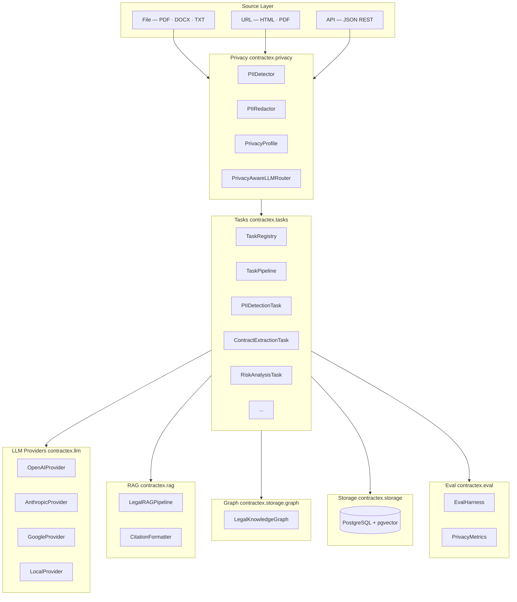
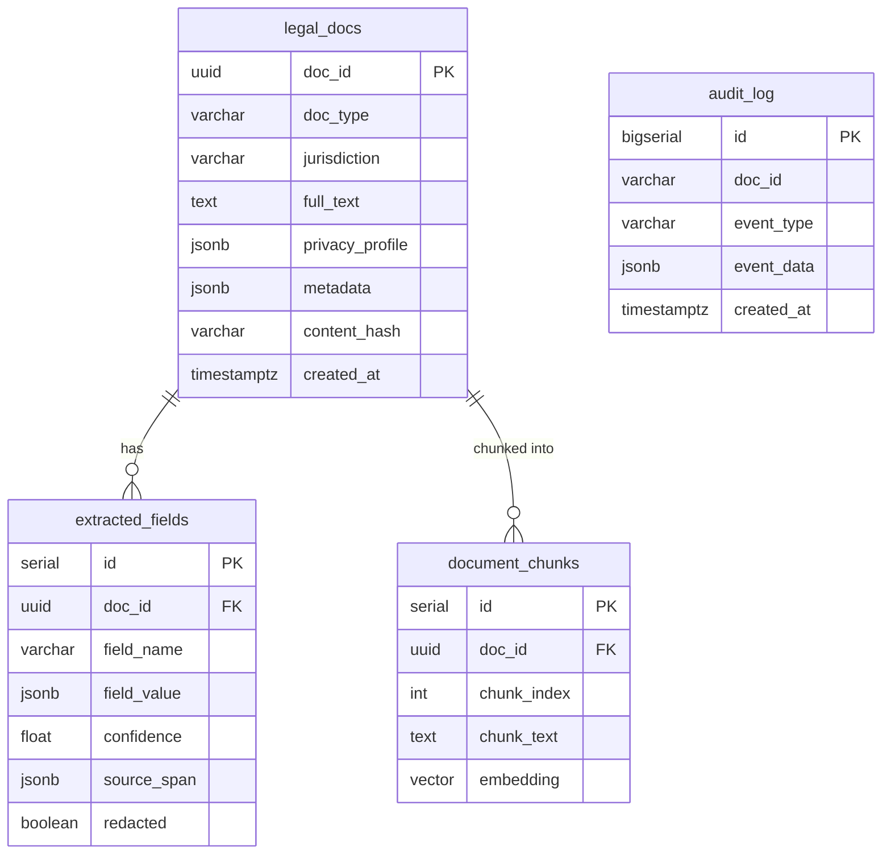

# ContracTeX — Open-Source Python Library for Legal Tech

[](https://badge.fury.io/py/contractex)
[](https://pypistats.org/packages/contractex)
[](https://www.python.org/downloads/)
[](https://opensource.org/licenses/Apache-2.0)

ContractEx is a Python library for legal document intelligence. It provides the processing layer—chunking, extraction, retrieval, privacy enforcement, and quality measurement—that legal AI products are built on top of. 

This project aims to democratise legal tech by building a transparent open-source library that changes who within the legal field gets to benefit from the latest developments in machine learning and AI. At the heart of this project is a commitment to auditability, robust engineering, and privacy by design.

The intended consumer is a developer building a backend service, Word plug-in, document automation tool, or RAG system over contracts. ContractEx handles the parts of that problem where getting it wrong produces hallucinated citations, PII leakage, or extraction that silently accepts low-confidence results. The product layer handles UX and workflow.

---

## Design principles

The hardest constraint in legal AI is that LLMs are probabilistic and legal conclusions need to be accountable.

**The deterministic/probabilistic boundary is explicit.** Risk flagging for known patterns (unlimited liability, auto-renewal, unilateral amendment) runs on a deterministic keyword-rule engine. Citation extraction runs on regex — no LLM involved. Clause classification against CUAD's 41 types runs on an LLM with a constrained output schema. The library does not blur this line: every task documents whether it uses an LLM and what the failure mode is when the model underperforms.

**Every extracted value is traceable.** Each field in the extraction output carries a `SourceSpan` — character offsets, page number, chunk identifier — back to its exact location in the source text. A `ProvenanceTracker` runs a two-pass match (exact substring, then Jaccard token overlap) to annotate the full extraction output after each task. In legal work, an answer without a citation is not an answer.

**Privacy is enforced in code, not in contracts.** The `PrivacyAwareLLMRouter` sits between every pipeline stage and every LLM call. It does not trust the calling code to make the right decision — it reads the document's `PrivacyProfile` and enforces routing before the prompt is constructed. A document classified `restricted` cannot reach a cloud provider regardless of what the application layer does.

**Quality is measurable, not assumed.** The `EvalHarness` runs labeled test suites against any extraction callable and produces field-level accuracy metrics with CI-ready assertion helpers. The standard objection to LLMs in legal work is that they hallucinate. The correct answer is not to argue against it — it is to measure it and gate on it.

---

## Privacy guarantees

The `PrivacyAwareLLMRouter` enforces sensitivity-level routing in code, at the call site, before any prompt is constructed.

```python
from contractex.privacy import PrivacyProfile, PIIDetector, PIIRedactor, RedactionStrategy
from contractex.privacy import PrivacyAwareLLMRouter
from contractex.llm import OpenAIProvider, LocalProvider

# Assign a sensitivity level to the document
doc.privacy_profile = PrivacyProfile(sensitivity="restricted")
# "restricted" → llm_routing = "local_only" (derived automatically)
# "secret"     → llm_routing = "blocked"

provider = OpenAIProvider(model="gpt-4o")
router   = PrivacyAwareLLMRouter()

# This raises PrivacyRoutingError — the cloud call never happens
result = router.route(doc, prompt, MySchema, provider=provider)

# Swap in a local provider and it succeeds
local_provider = LocalProvider(model="llama3.1:8b")
result = router.route(doc, prompt, MySchema, provider=local_provider)
```

What each level enforces at runtime:

| Sensitivity | Routing enforcement | PII handling |
|---|---|---|
| `public` | Any provider permitted | No action |
| `confidential` | Any provider permitted | PII detected and redacted before prompt construction; optionally de-anonymized on response |
| `restricted` | Raises `PrivacyRoutingError` if provider is not a `LocalProvider` | Auto-redact |
| `secret` | Raises `PrivacyBlockedError` before the prompt is constructed | — |

This is not a configuration setting that a misconfigured deployment can override. The enforcement runs inside `router.route()` — the call site of every LLM interaction in the pipeline. A law firm's IT policy that prohibits sending M&A documents to a cloud API is enforced by the library, not by trusting the application to check an environment variable.

The router also handles auto-redaction for `confidential` documents — running `PIIDetector` (Presidio if installed, regex fallback otherwise) on the prompt text, replacing PII spans with stable tokens (`<PERSON_1>`, `<ORG_2>`), and optionally restoring the original values in the response:

```python
redactor = PIIRedactor(strategy=RedactionStrategy.REPLACE)
router   = PrivacyAwareLLMRouter(redactor=redactor, auto_redact=True)

doc.privacy_profile = PrivacyProfile(sensitivity="confidential")
result = router.route(doc, prompt, MySchema, provider=provider, restore_redaction=True)
# Prompt sent to LLM: "... <PERSON_1> signed on behalf of <ORG_1> ..."
# Response returned:  "... Jane Doe signed on behalf of Acme Corp ..."
```

---

## Quality measurement

The standard objection to LLMs in legal work is that they hallucinate. ContractEx does not argue against this — it provides a harness for measuring it.

`EvalHarness` accepts any extraction callable with the signature `(EvalCase) -> dict[str, Any]` and runs it against a labeled suite. It produces per-field accuracy metrics, weighted by the importance of each field, with pytest-compatible assertion helpers that act as CI gates.

```python
from contractex.eval import EvalHarness, EvalSuite

# Load a labeled suite (YAML or inline)
suite = EvalSuite.load("tests/eval/msa_contracts.yaml")

# Wire up the pipeline under test
def my_extractor(case):
    doc = pipeline.run(LegalDoc(full_text=case.input_text))
    return doc.extracted["contract"].__dict__

harness = EvalHarness(extractor_fn=my_extractor)
metrics = harness.run(suite)

print(metrics.report())
# field_accuracy: 0.923
# case_accuracy:  0.87
# per_field: {"governing_law": 0.98, "expiration_date": 0.91, "liability_cap": 0.84, ...}

# CI gate — fails the test run if accuracy drops below threshold
metrics.assert_min_field_accuracy(0.90)
```

Field weights let suite authors declare that `liability_cap` accuracy matters more than `title`:

```yaml
# tests/eval/msa_contracts.yaml
- id: acme_msa_2024
  input_path: fixtures/acme_msa.pdf
  expected_fields:
    governing_law: "Delaware"
    liability_cap: "$2,000,000"
    auto_renewal: true
  field_weights:
    liability_cap: 3.0
    governing_law: 2.0
    title: 0.5
```

Privacy evaluation is a first-class harness mode. `run_privacy()` measures PII recall, redaction coverage, and routing correctness — including asserting that no `secret` document ever reaches a cloud provider:

```python
privacy_metrics = harness.run_privacy(suite, pii_detector_fn=..., router_fn=...)
privacy_metrics.assert_min_pii_recall(0.95)
privacy_metrics.assert_perfect_blocking()   # zero tolerance: secret docs never routed to cloud
```

The harness is provider-agnostic. Running the same suite against GPT-4o, Claude Opus, and a local Llama model and comparing `field_accuracy` and estimated cost per document is the correct way to make a model selection decision for a legal product.

---

## Legal-structure-aware chunking

Generic text splitters — whether token-count-based or sentence-boundary-based — produce incorrect results on legal documents. The failure mode is specific: a clause that runs across a chunk boundary gets split, the extraction prompt for each chunk sees an incomplete provision, and the resulting finding either misses the clause or misattributes it. When that finding is cited back to the user, the citation resolves to an incoherent fragment.

`ClauseAwareChunker` splits on legal structural markers instead of token counts:

- Numbered sections (`1.`, `2.1`, `Article 3`)
- Headed provisions (`WHEREAS`, `NOW THEREFORE`, `IN WITNESS WHEREOF`)
- Lettered subsections (`(a)`, `(i)`)
- Named clause blocks (`TERMINATION`, `INDEMNIFICATION`, `GOVERNING LAW`)

Each chunk corresponds to a complete clause or section. When extraction runs on a chunk and produces a citation, that citation resolves to a unit a lawyer can read and verify — not to a fragment whose meaning depends on the preceding or following chunk.

```python
from contractex.chunking import ClauseAwareChunker

chunker = ClauseAwareChunker(max_chunk_size=4000, overlap=200)
chunks  = chunker.chunk(doc.full_text)
# Each chunk begins and ends at a clause boundary
```

The alternative `SemanticChunker` is available for documents without clear structural markers — it splits where cosine similarity between adjacent sentences drops below a threshold. For well-structured commercial contracts, `ClauseAwareChunker` is the correct choice.

---

## Where ContractEx fits in a stack

ContractEx is a processing layer dependency, not a standalone service. The integration pattern for a legal AI product looks like this:

```
User interface (Word add-in / web app)
        ↓
API layer (FastAPI / Django)
        ↓
ContractEx pipeline
    └── Document load (PDF, DOCX, URL)
    └── Privacy gate (PrivacyAwareLLMRouter — enforced before any LLM call)
    └── Clause-aware chunking
    └── Extraction / retrieval / risk analysis
    └── Provenance annotation (SourceSpan per field)
    └── Confidence routing (auto-accept / human-review / reject)
        ↓
Storage (PostgreSQL + pgvector, or local)
        ↓
Findings / answers / suggestions — with citations
```

ContractEx is installed as a Python dependency (`pip install contractex`) and called from application code. It does not run as a service, does not require a dedicated infrastructure component, and does not impose a framework. The LLM provider, chunking strategy, storage backend, and audit logger are all swappable at construction time.

**Playbook schemas** are strongly typed Python objects, not flat YAML. The NDA and SaaS playbooks ship as `PlaybookSchema` instances with typed clause definitions and expected field sets. A product that wants to add a playbook for a new document type extends `PlaybookSchema` — the type system catches missing fields at import time, not at runtime when a lawyer is reviewing a document.

**LangChain compatibility** is provided via a `langchain_compat` loader and `LangChainProvider` wrapper for teams already using that framework. Teams that are not using LangChain have no transitive dependency on it.

---

## Contents

- [Design principles](#design-principles)
- [Privacy guarantees](#privacy-guarantees)
- [Quality measurement](#quality-measurement)
- [Legal-structure-aware chunking](#legal-structure-aware-chunking)
- [Where ContractEx fits in a stack](#where-contractex-fits-in-a-stack)
- [Installation](#installation)
- [Quick start](#quick-start)
- [Privacy model (detailed)](#privacy-model)
- [Task catalogue](#task-catalogue)
- [Pipeline composition](#pipeline-composition)
- [RAG pipeline](#rag-pipeline)
- [Knowledge graph](#knowledge-graph)
- [Architecture](#architecture)
- [Storage layer](#storage-layer)
- [Eval harness (detailed)](#eval-harness)
- [LLM providers](#llm-providers)
- [Examples](#examples)
- [Development](#development)

---

## Privacy model

ContractEx treats privacy as a pipeline constraint, not an optional add-on. Every `LegalDoc` carries a `PrivacyProfile` that governs what the library is permitted to do with it.

```python
from contractex.privacy import PrivacyProfile, PIIDetector, PIIRedactor, RedactionStrategy

# 1. Classify sensitivity
profile = PrivacyProfile(sensitivity="restricted")
# restricted → llm_routing = "local_only" (automatically derived)
# secret     → llm_routing = "blocked"

# 2. Detect PII
detector = PIIDetector()                         # uses Presidio if installed, else regex fallback
spans = detector.detect(doc.full_text)
# → [PIISpan(entity_type="PERSON", text="Jane Doe", ...), ...]

# 3. Redact before any LLM call
redactor = PIIRedactor(strategy=RedactionStrategy.REPLACE)
redacted  = redactor.redact(doc.full_text, spans)
# "Jane Doe signed on ..." → "<PERSON_1> signed on ..."

# 4. Privacy-aware routing enforces policy automatically
from contractex.privacy import PrivacyAwareLLMRouter
router = PrivacyAwareLLMRouter(redactor=redactor)
answer = router.route(doc, prompt, schema, provider=llm, restore_redaction=True)
# raises PrivacyBlockedError for secret docs
# auto-redacts + restores for confidential docs
```

See [Privacy guarantees](#privacy-guarantees) above for the router code example and the full enforcement table.

Install the privacy extras to enable Presidio-backed PII detection:

```bash
pip install -e ".[privacy]"
```

---

## Installation

```bash
git clone https://github.com/Quiet-Signals-Lab/Contractex-Legal-Tech-Library.git
cd Contractex-Legal-Tech-Library

# Full install (all optional extras)
pip install -e ".[all]"

# Pick what you need
pip install -e ".[privacy]"   # Presidio PII detection + AES redaction
pip install -e ".[rag]"       # sentence-transformers for RAG pipeline
pip install -e ".[graph]"     # networkx + neo4j for knowledge graph
pip install -e ".[storage]"   # PostgreSQL persistence
pip install -e ".[eval]"      # EvalHarness (pyyaml)
pip install -e ".[local]"     # Local LLM via Ollama
pip install -e ".[spacy]"     # Named entity recognition
pip install -e ".[ocr]"       # OCR for scanned PDFs
pip install -e ".[network]"   # URLLoader / APILoader
```

Configure API keys:

```bash
export OPENAI_API_KEY=sk-...
export ANTHROPIC_API_KEY=sk-ant-...
export GOOGLE_API_KEY=...
```

---

## Quick start

```python
from contractex import LegalDoc, TaskRegistry
from contractex.core.legal_document import DocType

# Build a document
doc = LegalDoc(doc_type=DocType.CONTRACT, full_text=open("contract.pdf").read())

# Run a task pipeline
registry = TaskRegistry.default()
pipeline = registry.build_pipeline(["pii_detection", "contract_extraction", "risk_analysis"])
result   = pipeline.run(doc)

print(result.extracted["contract"])          # structured Contract model
print(result.extracted["risks"])             # list of RiskFlag
print(result.privacy_profile.pii_entities_found)
```

Or use the one-liner legacy API:

```python
from contractex import extract_contract
contract = extract_contract("contract.pdf")
print(f"Parties: {[p.name for p in contract.parties]}")
```

---

## Task catalogue

ContractEx ships the following built-in tasks. All tasks accept a `LegalDoc` and return a `LegalDoc` with results written into `doc.extracted[<key>]`.

| `task_id` | Output key | Doc types | Notes |
|---|---|---|---|
| `pii_detection` | `pii_spans` | all | Updates `doc.privacy_profile` |
| `contract_extraction` | `contract` | CONTRACT | Full `Contract` model |
| `classification` | `cuad_labels` | CONTRACT | 41 CUAD clause types |
| `risk_analysis` | `risks` | CONTRACT | `RiskFlag` list |
| `ner` | `ner_entities` | all | spaCy / Blackstone |
| `summarization` | `summary` | all | LLM summary |
| `timeline` | `timeline` | all | Key dates + deadlines |
| `obligations` | `obligations` | CONTRACT, STATUTE, REGULATION, PLEADING | Party obligations |
| `comparison` | `comparison` | all | Diff two docs via `doc_b=` kwarg |
| `citation` | `citations` | all | Regex citation extraction (no LLM) |

### PII detection

```python
from contractex.tasks import TaskRegistry

pipeline = TaskRegistry.default().build_pipeline(["pii_detection"])
result   = pipeline.run(doc)
print(result.extracted["pii_spans"])
# → [{"entity_type": "PERSON", "text": "Alice Smith", "score": 0.97}, ...]
```

### Contract extraction

```python
pipeline = TaskRegistry.default().build_pipeline(
    ["pii_detection", "contract_extraction"],
    task_kwargs={"contract_extraction": {"analyze_risks": True}},
)
result = pipeline.run(doc)
contract = result.extracted["contract"]
print(contract.parties, contract.clauses)
```

### Citation extraction (no LLM required)

```python
pipeline = TaskRegistry.default().build_pipeline(["citation"])
result   = pipeline.run(doc)
print(result.extracted["citations"])
# → ["17 U.S.C. § 107", "Regulation (EU) 2016/679 Art. 17", ...]
```

### Document comparison

```python
from contractex.tasks import TaskRegistry

pipeline = TaskRegistry.default().build_pipeline(["comparison"])
result   = pipeline.run(doc_a, doc_b=doc_b)
diff     = result.extracted["comparison"]
print(diff.summary)
```

---

## Pipeline composition

```python
from contractex import LegalDoc, TaskRegistry
from contractex.tasks import TaskPipeline

registry = TaskRegistry.default()

# Ad-hoc pipeline
pipeline = TaskPipeline([
    registry.get("pii_detection"),
    registry.get("contract_extraction"),
    registry.get("risk_analysis"),
    registry.get("timeline"),
])

result = pipeline.run(doc)
print(result.extracted["_task_timings"])   # per-task elapsed seconds

# Async
import asyncio
result = asyncio.run(pipeline.run_async(doc))
```

Register a custom task:

```python
from contractex.tasks import LegalTask
from contractex import LegalDoc
from contractex.core.legal_document import DocType

class MyTask(LegalTask):
    task_id   = "my_custom_task"
    doc_types = [DocType.CONTRACT]
    requires_llm = False

    def run(self, doc: LegalDoc, **kwargs) -> LegalDoc:
        doc.extracted["my_result"] = {"hello": "world"}
        return doc

TaskRegistry.default().register(MyTask)
```

---

## RAG pipeline

`LegalRAGPipeline` ingests legal documents into a vector store and answers natural-language questions with cited source passages.

```python
from contractex.rag import LegalRAGPipeline
from contractex.llm import OpenAIProvider

rag = LegalRAGPipeline(
    llm_provider=OpenAIProvider(model="gpt-4o"),
    embedding_model="all-MiniLM-L6-v2",   # sentence-transformers
    citation_format="bluebook",
)

# Ingest documents (URLs, file paths, or LegalDoc objects)
result = rag.ingest([
    "https://www.law.cornell.edu/uscode/text/17/107",
    "contracts/msa.pdf",
])
print(f"Ingested {result.ingested} docs, skipped {result.skipped}")

# Query
response = rag.query("What are the fair use factors under 17 USC 107?")
print(response.answer)
print(response.citations)   # list of Citation with source + page
print(response.disclaimer)  # always present: "This is legal information, not advice."

# Streaming
for chunk in rag.query("Summarise the termination clause.", stream=True):
    print(chunk.answer, end="", flush=True)

# Async
import asyncio
response = asyncio.run(rag.query_async("What is the governing law?"))
```

Privacy is enforced automatically: documents with `sensitivity="secret"` are indexed but never included in LLM context windows.

Install RAG dependencies:

```bash
pip install -e ".[rag]"
```

---

## Knowledge graph

`LegalKnowledgeGraph` builds a semantic graph over parties, documents, clauses, jurisdictions, and citations — enabling cross-document reasoning.

```python
from contractex.storage.graph import LegalKnowledgeGraph

graph = LegalKnowledgeGraph(backend="networkx")   # or "neo4j"

# Add documents
graph.add_document(doc_a)
graph.add_document(doc_b)

# Entity resolution: same company mentioned under different names
graph.resolve_entity("Acme Corp.", "Party")       # deduplicates via string similarity

# Find related documents
related = graph.find_related(doc_a.doc_id, depth=2)
print(related.nodes, related.edges)

# Add a citation link
graph.add_citation(
    source_doc_id=doc_a.doc_id,
    target_citation="17 U.S.C. § 107",
)

# Export to Turtle RDF (requires rdflib)
graph.export_rdf("knowledge_graph.ttl")
```

Install graph dependencies:

```bash
pip install -e ".[graph]"      # networkx (+ neo4j if using Neo4j backend)
```

---

## Architecture

ContractEx is structured as a layered pipeline. Each layer can be used independently or composed into a full pipeline.



### Module map

```text
contractex/
├── core/
│   ├── document.py          # LegalDoc — unified base model (NEW)
│   ├── legal_document.py    # DocType · SourceSpan · LegalDocumentMetadata
│   ├── models.py            # Contract · Clause · Party · FinancialTerm · RiskFlag
│   ├── extractors.py        # ContractExtractor (multi-phase orchestrator)
│   ├── analyzers.py         # RiskAnalyzer
│   ├── classifiers.py       # CUADClassifier (41 clause types)
│   └── ner.py               # LegalNER (spaCy / Blackstone)
│
├── privacy/                 # NEW — mandatory pipeline stage
│   ├── profile.py           # PrivacyProfile · RedactionStrategy
│   ├── detector.py          # PIIDetector · PIISpan (Presidio + regex fallback)
│   ├── redactor.py          # PIIRedactor · RedactedText · RedactionMap
│   └── router.py            # PrivacyAwareLLMRouter
│
├── tasks/                   # NEW — task registry pattern
│   ├── base.py              # LegalTask ABC · TaskPipeline
│   ├── registry.py          # TaskRegistry singleton
│   ├── pii_detection.py     # PIIDetectionTask
│   ├── extraction.py        # ContractExtractionTask
│   ├── classification.py    # ClassificationTask
│   ├── risk_analysis.py     # RiskAnalysisTask
│   ├── ner.py               # NERTask
│   ├── summarization.py     # SummarizationTask
│   ├── timeline.py          # TimelineTask
│   ├── obligations.py       # ObligationsTask
│   ├── comparison.py        # ComparisonTask
│   └── citation.py          # CitationTask (regex only)
│
├── rag/                     # NEW — RAG pipeline
│   ├── pipeline.py          # LegalRAGPipeline · RAGResponse · IngestResult
│   └── citation.py          # Citation · CitationFormatter
│
├── llm/
│   ├── base.py              # LLMProvider ABC (+ stream_complete)
│   ├── openai_provider.py   # GPT-4o (native streaming)
│   ├── anthropic_provider.py# Claude (native streaming)
│   ├── google_provider.py   # Gemini
│   └── local_provider.py    # Ollama
│
├── storage/
│   ├── schema_v2.sql        # Generic schema (NEW) — legal_docs + extracted_fields
│   ├── schema.sql           # v1 schema (kept for reference)
│   ├── graph.py             # LegalKnowledgeGraph (NEW)
│   ├── repository.py        # DocumentRepository · ClauseRepository
│   └── migrations/
│       ├── v1_to_v2.sql     # Migration from v1 schema (NEW)
│       └── add_embeddings.sql
│
├── eval/
│   ├── cases.py             # EvalCase (+ privacy fields) · EvalSuite
│   ├── metrics.py           # ExtractionMetrics · PrivacyMetrics (NEW)
│   └── harness.py           # EvalHarness (+ run_privacy method) (NEW)
│
├── loaders/                 # DocumentLoader ABC + PDF · DOCX · Text · URL · API
├── chunking/                # ClauseAwareChunker · SemanticChunker
├── taxonomy/                # CUAD 41-type taxonomy
├── prompts/                 # Prompt templates
└── utils/                   # Audit · Provenance · ConfidenceRouter · Exporters
```

---

## Storage layer

Schema v2 (`contractex/storage/schema_v2.sql`) replaces the contract-specific v1 schema with a generic model supporting all document types.



A backward-compatible `clauses` VIEW over `extracted_fields` preserves v1 consumer compatibility.

GDPR right-to-erasure is handled by `gdpr_erase_document(doc_id, hmac_key)` which cascades the delete and replaces the doc_id in `audit_log` with an HMAC-SHA256 hash.

To migrate an existing v1 database:

```bash
psql your_database < contractex/storage/migrations/v1_to_v2.sql
```

---

## Eval harness

`EvalHarness` runs labeled test suites against any extraction callable and produces quality metrics with pytest-compatible assertion helpers. v2 adds first-class privacy evaluation.

```python
from contractex.eval import EvalHarness, EvalSuite, PrivacyMetrics

suite = EvalSuite.load("tests/eval/contracts.yaml")

# Extraction quality
harness = EvalHarness(extractor_fn=lambda case: pipeline.run(case))
metrics = harness.run(suite)
print(metrics.report())
metrics.assert_min_field_accuracy(0.90)   # CI gate

# Privacy evaluation
privacy_metrics = harness.run_privacy(
    suite,
    pii_detector_fn=lambda case: detector.detect_entity_types(case.input_text or ""),
    redactor_fn=lambda case: len(redactor.redact(case.input_text or "", spans).span_count),
    router_fn=lambda case: router.would_block(doc),
)
print(privacy_metrics.report())
privacy_metrics.assert_min_pii_recall(0.95)
privacy_metrics.assert_perfect_blocking()
```

Privacy fields on `EvalCase`:

```yaml
- id: restricted_nda
  sensitivity: restricted
  should_be_blocked: false
  expected_pii_entities: [PERSON, EMAIL_ADDRESS]
  expected_redaction_count: 4
  input_text: "Alice Smith (alice@acme.com) agrees..."
```

---

## LLM providers

All providers implement the same `LLMProvider` ABC — including the new `stream_complete()` method added in v2.

```python
from contractex.llm import OpenAIProvider, AnthropicProvider, GoogleProvider, LocalProvider

llm = OpenAIProvider(model="gpt-4o")           # native streaming
llm = AnthropicProvider(model="claude-opus-4-6") # native streaming
llm = GoogleProvider(model="gemini-2.5-pro")
llm = LocalProvider(model="llama3.1:8b")        # requires Ollama

# Streaming (OpenAI and Anthropic yield tokens natively; others yield full response)
for token in llm.stream_complete("Summarise this NDA in three bullet points."):
    print(token, end="", flush=True)

# Async streaming
async for token in llm.stream_complete_async(prompt):
    print(token, end="", flush=True)
```

| Provider | Recommended model | Characteristics |
| --- | --- | --- |
| OpenAI | `gpt-4o` | Strong structured output; [see pricing](https://openai.com/pricing) |
| Anthropic | `claude-opus-4-6` | Largest context window; [see pricing](https://www.anthropic.com/pricing) |
| Google | `gemini-2.5-pro` | Fastest inference; [see pricing](https://ai.google.dev/pricing) |
| Local | any Ollama model | Air-gapped deployments; no cost, no data egress |

---

## Examples

| File | What it shows |
|---|---|
| [examples/basic_extraction.py](examples/basic_extraction.py) | One-line contract extraction |
| [examples/advanced_extraction.py](examples/advanced_extraction.py) | Custom LLM + chunker config |
| [examples/batch_processing.py](examples/batch_processing.py) | Parallel extraction over many documents |
| [examples/fastapi_service.py](examples/fastapi_service.py) | REST API wrapper |
| [examples/storage_example.py](examples/storage_example.py) | PostgreSQL persistence |
| [examples/ner_example.py](examples/ner_example.py) | Named entity recognition |
| [examples/local_llm_example.py](examples/local_llm_example.py) | Offline extraction with Ollama |
| [examples/langchain_integration.py](examples/langchain_integration.py) | LangChain compatibility |
| [examples/dataset_loading.py](examples/dataset_loading.py) | CUAD / ACORD / LePaRD datasets |

---

## Development

```bash
# Run all unit tests (no database required)
python -m pytest tests/ -m "not integration" --no-cov -v

# Run with coverage
python -m pytest --cov=contractex --cov-report=html

# Code quality
black contractex/
ruff check contractex/ --fix
mypy contractex/
```

See [ARCHITECTURE.md](ARCHITECTURE.md) for a deeper design walkthrough and [docs/RELEASE_WORKFLOW.md](docs/RELEASE_WORKFLOW.md) for the release process.

---

## License

Apache 2.0 — see [LICENSE](LICENSE) for details.

