# ContractEx — Legal Document Intelligence for Python

[](https://badge.fury.io/py/contractex)
[](https://pypistats.org/packages/contractex)
[](https://www.python.org/downloads/)
[](https://opensource.org/licenses/Apache-2.0)

ContractEx is a production-ready Python library for LLM-powered legal document intelligence. Every operation is a composable `LegalTask` that takes a `LegalDoc` and returns a `LegalDoc`, making it trivial to build privacy-respecting extraction pipelines, RAG chatbots, and document-automation workflows over contracts, statutes, regulations, identity documents, and more. Privacy controls are a mandatory first-class stage in every pipeline — not an afterthought.

---

## Contents

- [Privacy model](#privacy-model) ← read this first
- [Installation](#installation)
- [Quick start](#quick-start)
- [Task catalogue](#task-catalogue)
- [Pipeline composition](#pipeline-composition)
- [RAG pipeline](#rag-pipeline)
- [Knowledge graph](#knowledge-graph)
- [Architecture](#architecture)
- [Storage layer](#storage-layer)
- [Eval harness](#eval-harness)
- [LLM providers](#llm-providers)
- [Examples](#examples)
- [Development](#development)

---

## Privacy model

ContractEx treats privacy as a pipeline constraint, not an optional add-on. Every `LegalDoc` carries a `PrivacyProfile` that governs what the library is permitted to do with it.

```python
from contractex.privacy import PrivacyProfile, PIIDetector, PIIRedactor, RedactionStrategy

# 1. Classify sensitivity
profile = PrivacyProfile(sensitivity="restricted")
# restricted → llm_routing = "local_only" (automatically derived)
# secret     → llm_routing = "blocked"

# 2. Detect PII
detector = PIIDetector()                         # uses Presidio if installed, else regex fallback
spans = detector.detect(doc.full_text)
# → [PIISpan(entity_type="PERSON", text="Jane Doe", ...), ...]

# 3. Redact before any LLM call
redactor = PIIRedactor(strategy=RedactionStrategy.REPLACE)
redacted  = redactor.redact(doc.full_text, spans)
# "Jane Doe signed on ..." → "<PERSON_1> signed on ..."

# 4. Privacy-aware routing enforces policy automatically
from contractex.privacy import PrivacyAwareLLMRouter
router = PrivacyAwareLLMRouter(redactor=redactor)
answer = router.route(doc, prompt, schema, provider=llm, restore_redaction=True)
# raises PrivacyBlockedError for secret docs
# auto-redacts + restores for confidential docs
```

**Sensitivity routing rules:**

| Sensitivity | LLM routing | Auto-redact |
|---|---|---|
| `public` | any provider | no |
| `confidential` | any provider | yes |
| `restricted` | local-only | yes |
| `secret` | blocked | — |

Install the privacy extras to enable Presidio-backed PII detection:

```bash
pip install -e ".[privacy]"
```

---

## Installation

```bash
git clone https://github.com/aahepburn/Contract-Clause-Extractor.git
cd Contract-Clause-Extractor

# Full install (all optional extras)
pip install -e ".[all]"

# Pick what you need
pip install -e ".[privacy]"   # Presidio PII detection + AES redaction
pip install -e ".[rag]"       # sentence-transformers for RAG pipeline
pip install -e ".[graph]"     # networkx + neo4j for knowledge graph
pip install -e ".[storage]"   # PostgreSQL persistence
pip install -e ".[eval]"      # EvalHarness (pyyaml)
pip install -e ".[local]"     # Local LLM via Ollama
pip install -e ".[spacy]"     # Named entity recognition
pip install -e ".[ocr]"       # OCR for scanned PDFs
pip install -e ".[network]"   # URLLoader / APILoader
```

Configure API keys:

```bash
export OPENAI_API_KEY=sk-...
export ANTHROPIC_API_KEY=sk-ant-...
export GOOGLE_API_KEY=...
```

---

## Quick start

```python
from contractex import LegalDoc, TaskRegistry
from contractex.core.legal_document import DocType

# Build a document
doc = LegalDoc(doc_type=DocType.CONTRACT, full_text=open("contract.pdf").read())

# Run a task pipeline
registry = TaskRegistry.default()
pipeline = registry.build_pipeline(["pii_detection", "contract_extraction", "risk_analysis"])
result   = pipeline.run(doc)

print(result.extracted["contract"])          # structured Contract model
print(result.extracted["risks"])             # list of RiskFlag
print(result.privacy_profile.pii_entities_found)
```

Or use the one-liner legacy API:

```python
from contractex import extract_contract
contract = extract_contract("contract.pdf")
print(f"Parties: {[p.name for p in contract.parties]}")
```

---

## Task catalogue

ContractEx ships the following built-in tasks. All tasks accept a `LegalDoc` and return a `LegalDoc` with results written into `doc.extracted[<key>]`.

| `task_id` | Output key | Doc types | Notes |
|---|---|---|---|
| `pii_detection` | `pii_spans` | all | Updates `doc.privacy_profile` |
| `contract_extraction` | `contract` | CONTRACT | Full `Contract` model |
| `classification` | `cuad_labels` | CONTRACT | 41 CUAD clause types |
| `risk_analysis` | `risks` | CONTRACT | `RiskFlag` list |
| `ner` | `ner_entities` | all | spaCy / Blackstone |
| `summarization` | `summary` | all | LLM summary |
| `timeline` | `timeline` | all | Key dates + deadlines |
| `obligations` | `obligations` | CONTRACT, STATUTE, REGULATION, PLEADING | Party obligations |
| `comparison` | `comparison` | all | Diff two docs via `doc_b=` kwarg |
| `citation` | `citations` | all | Regex citation extraction (no LLM) |

### PII detection

```python
from contractex.tasks import TaskRegistry

pipeline = TaskRegistry.default().build_pipeline(["pii_detection"])
result   = pipeline.run(doc)
print(result.extracted["pii_spans"])
# → [{"entity_type": "PERSON", "text": "Alice Smith", "score": 0.97}, ...]
```

### Contract extraction

```python
pipeline = TaskRegistry.default().build_pipeline(
    ["pii_detection", "contract_extraction"],
    task_kwargs={"contract_extraction": {"analyze_risks": True}},
)
result = pipeline.run(doc)
contract = result.extracted["contract"]
print(contract.parties, contract.clauses)
```

### Citation extraction (no LLM required)

```python
pipeline = TaskRegistry.default().build_pipeline(["citation"])
result   = pipeline.run(doc)
print(result.extracted["citations"])
# → ["17 U.S.C. § 107", "Regulation (EU) 2016/679 Art. 17", ...]
```

### Document comparison

```python
from contractex.tasks import TaskRegistry

pipeline = TaskRegistry.default().build_pipeline(["comparison"])
result   = pipeline.run(doc_a, doc_b=doc_b)
diff     = result.extracted["comparison"]
print(diff.summary)
```

---

## Pipeline composition

```python
from contractex import LegalDoc, TaskRegistry
from contractex.tasks import TaskPipeline

registry = TaskRegistry.default()

# Ad-hoc pipeline
pipeline = TaskPipeline([
    registry.get("pii_detection"),
    registry.get("contract_extraction"),
    registry.get("risk_analysis"),
    registry.get("timeline"),
])

result = pipeline.run(doc)
print(result.extracted["_task_timings"])   # per-task elapsed seconds

# Async
import asyncio
result = asyncio.run(pipeline.run_async(doc))
```

Register a custom task:

```python
from contractex.tasks import LegalTask
from contractex import LegalDoc
from contractex.core.legal_document import DocType

class MyTask(LegalTask):
    task_id   = "my_custom_task"
    doc_types = [DocType.CONTRACT]
    requires_llm = False

    def run(self, doc: LegalDoc, **kwargs) -> LegalDoc:
        doc.extracted["my_result"] = {"hello": "world"}
        return doc

TaskRegistry.default().register(MyTask)
```

---

## RAG pipeline

`LegalRAGPipeline` ingests legal documents into a vector store and answers natural-language questions with cited source passages.

```python
from contractex.rag import LegalRAGPipeline
from contractex.llm import OpenAIProvider

rag = LegalRAGPipeline(
    llm_provider=OpenAIProvider(model="gpt-4o"),
    embedding_model="all-MiniLM-L6-v2",   # sentence-transformers
    citation_format="bluebook",
)

# Ingest documents (URLs, file paths, or LegalDoc objects)
result = rag.ingest([
    "https://www.law.cornell.edu/uscode/text/17/107",
    "contracts/msa.pdf",
])
print(f"Ingested {result.ingested} docs, skipped {result.skipped}")

# Query
response = rag.query("What are the fair use factors under 17 USC 107?")
print(response.answer)
print(response.citations)   # list of Citation with source + page
print(response.disclaimer)  # always present: "This is legal information, not advice."

# Streaming
for chunk in rag.query("Summarise the termination clause.", stream=True):
    print(chunk.answer, end="", flush=True)

# Async
import asyncio
response = asyncio.run(rag.query_async("What is the governing law?"))
```

Privacy is enforced automatically: documents with `sensitivity="secret"` are indexed but never included in LLM context windows.

Install RAG dependencies:

```bash
pip install -e ".[rag]"
```

---

## Knowledge graph

`LegalKnowledgeGraph` builds a semantic graph over parties, documents, clauses, jurisdictions, and citations — enabling cross-document reasoning.

```python
from contractex.storage.graph import LegalKnowledgeGraph

graph = LegalKnowledgeGraph(backend="networkx")   # or "neo4j"

# Add documents
graph.add_document(doc_a)
graph.add_document(doc_b)

# Entity resolution: same company mentioned under different names
graph.resolve_entity("Acme Corp.", "Party")       # deduplicates via string similarity

# Find related documents
related = graph.find_related(doc_a.doc_id, depth=2)
print(related.nodes, related.edges)

# Add a citation link
graph.add_citation(
    source_doc_id=doc_a.doc_id,
    target_citation="17 U.S.C. § 107",
)

# Export to Turtle RDF (requires rdflib)
graph.export_rdf("knowledge_graph.ttl")
```

Install graph dependencies:

```bash
pip install -e ".[graph]"      # networkx (+ neo4j if using Neo4j backend)
```

---

## Architecture

ContractEx is structured as a layered pipeline. Each layer can be used independently or composed into a full pipeline.

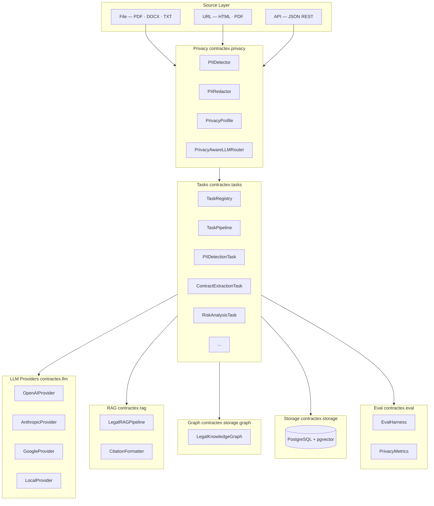

### Module map

```text
contractex/
├── core/
│   ├── document.py          # LegalDoc — unified base model (NEW)
│   ├── legal_document.py    # DocType · SourceSpan · LegalDocumentMetadata
│   ├── models.py            # Contract · Clause · Party · FinancialTerm · RiskFlag
│   ├── extractors.py        # ContractExtractor (multi-phase orchestrator)
│   ├── analyzers.py         # RiskAnalyzer
│   ├── classifiers.py       # CUADClassifier (41 clause types)
│   └── ner.py               # LegalNER (spaCy / Blackstone)
│
├── privacy/                 # NEW — mandatory pipeline stage
│   ├── profile.py           # PrivacyProfile · RedactionStrategy
│   ├── detector.py          # PIIDetector · PIISpan (Presidio + regex fallback)
│   ├── redactor.py          # PIIRedactor · RedactedText · RedactionMap
│   └── router.py            # PrivacyAwareLLMRouter
│
├── tasks/                   # NEW — task registry pattern
│   ├── base.py              # LegalTask ABC · TaskPipeline
│   ├── registry.py          # TaskRegistry singleton
│   ├── pii_detection.py     # PIIDetectionTask
│   ├── extraction.py        # ContractExtractionTask
│   ├── classification.py    # ClassificationTask
│   ├── risk_analysis.py     # RiskAnalysisTask
│   ├── ner.py               # NERTask
│   ├── summarization.py     # SummarizationTask
│   ├── timeline.py          # TimelineTask
│   ├── obligations.py       # ObligationsTask
│   ├── comparison.py        # ComparisonTask
│   └── citation.py          # CitationTask (regex only)
│
├── rag/                     # NEW — RAG pipeline
│   ├── pipeline.py          # LegalRAGPipeline · RAGResponse · IngestResult
│   └── citation.py          # Citation · CitationFormatter
│
├── llm/
│   ├── base.py              # LLMProvider ABC (+ stream_complete)
│   ├── openai_provider.py   # GPT-4o (native streaming)
│   ├── anthropic_provider.py# Claude (native streaming)
│   ├── google_provider.py   # Gemini
│   └── local_provider.py    # Ollama
│
├── storage/
│   ├── schema_v2.sql        # Generic schema (NEW) — legal_docs + extracted_fields
│   ├── schema.sql           # v1 schema (kept for reference)
│   ├── graph.py             # LegalKnowledgeGraph (NEW)
│   ├── repository.py        # DocumentRepository · ClauseRepository
│   └── migrations/
│       ├── v1_to_v2.sql     # Migration from v1 schema (NEW)
│       └── add_embeddings.sql
│
├── eval/
│   ├── cases.py             # EvalCase (+ privacy fields) · EvalSuite
│   ├── metrics.py           # ExtractionMetrics · PrivacyMetrics (NEW)
│   └── harness.py           # EvalHarness (+ run_privacy method) (NEW)
│
├── loaders/                 # DocumentLoader ABC + PDF · DOCX · Text · URL · API
├── chunking/                # ClauseAwareChunker · SemanticChunker
├── taxonomy/                # CUAD 41-type taxonomy
├── prompts/                 # Prompt templates
└── utils/                   # Audit · Provenance · ConfidenceRouter · Exporters
```

---

## Storage layer

Schema v2 (`contractex/storage/schema_v2.sql`) replaces the contract-specific v1 schema with a generic model supporting all document types.

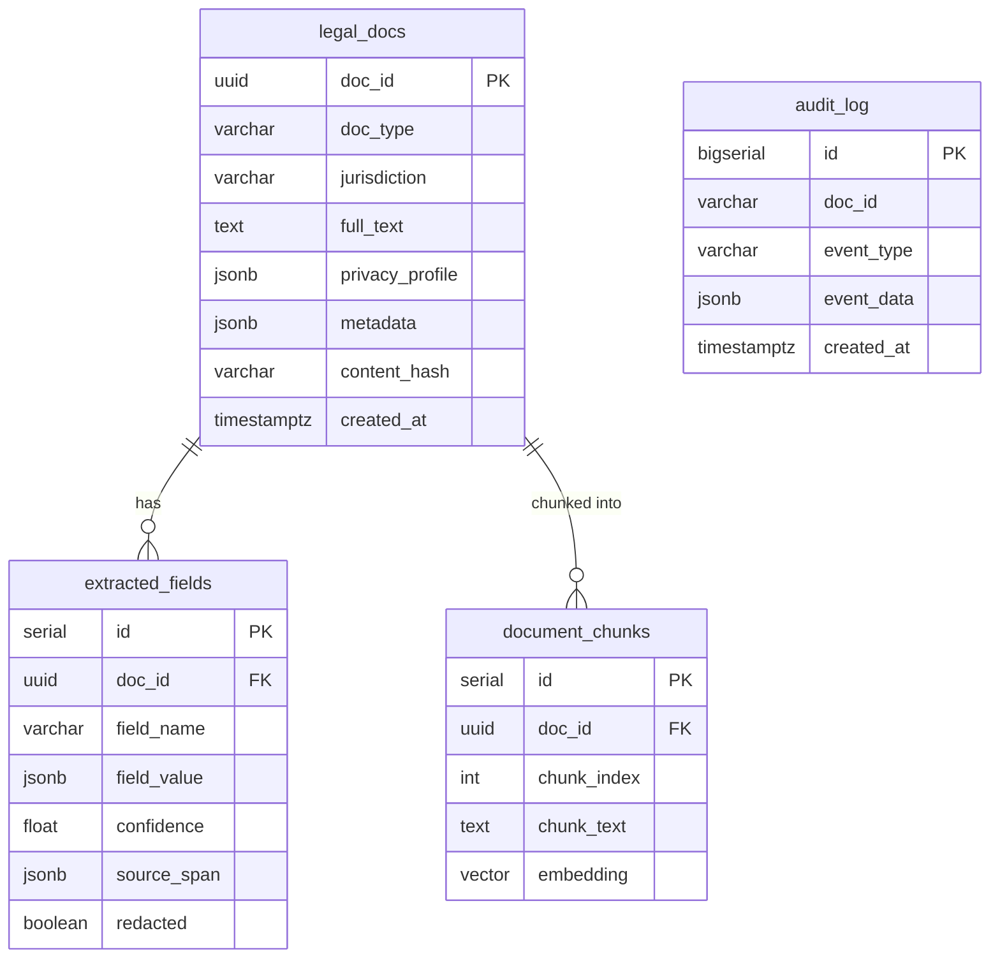

A backward-compatible `clauses` VIEW over `extracted_fields` preserves v1 consumer compatibility.

GDPR right-to-erasure is handled by `gdpr_erase_document(doc_id, hmac_key)` which cascades the delete and replaces the doc_id in `audit_log` with an HMAC-SHA256 hash.

To migrate an existing v1 database:

```bash
psql your_database < contractex/storage/migrations/v1_to_v2.sql
```

---

## Eval harness

`EvalHarness` runs labeled test suites against any extraction callable and produces quality metrics with pytest-compatible assertion helpers. v2 adds first-class privacy evaluation.

```python
from contractex.eval import EvalHarness, EvalSuite, PrivacyMetrics

suite = EvalSuite.load("tests/eval/contracts.yaml")

# Extraction quality
harness = EvalHarness(extractor_fn=lambda case: pipeline.run(case))
metrics = harness.run(suite)
print(metrics.report())
metrics.assert_min_field_accuracy(0.90)   # CI gate

# Privacy evaluation
privacy_metrics = harness.run_privacy(
    suite,
    pii_detector_fn=lambda case: detector.detect_entity_types(case.input_text or ""),
    redactor_fn=lambda case: len(redactor.redact(case.input_text or "", spans).span_count),
    router_fn=lambda case: router.would_block(doc),
)
print(privacy_metrics.report())
privacy_metrics.assert_min_pii_recall(0.95)
privacy_metrics.assert_perfect_blocking()
```

Privacy fields on `EvalCase`:

```yaml
- id: restricted_nda
  sensitivity: restricted
  should_be_blocked: false
  expected_pii_entities: [PERSON, EMAIL_ADDRESS]
  expected_redaction_count: 4
  input_text: "Alice Smith (alice@acme.com) agrees..."
```

---

## LLM providers

All providers implement the same `LLMProvider` ABC — including the new `stream_complete()` method added in v2.

```python
from contractex.llm import OpenAIProvider, AnthropicProvider, GoogleProvider, LocalProvider

llm = OpenAIProvider(model="gpt-4o")           # native streaming
llm = AnthropicProvider(model="claude-opus-4-6") # native streaming
llm = GoogleProvider(model="gemini-2.5-pro")
llm = LocalProvider(model="llama3.1:8b")        # requires Ollama

# Streaming (OpenAI and Anthropic yield tokens natively; others yield full response)
for token in llm.stream_complete("Summarise this NDA in three bullet points."):
    print(token, end="", flush=True)

# Async streaming
async for token in llm.stream_complete_async(prompt):
    print(token, end="", flush=True)
```

| Provider | Recommended model | Cost/contract | Best for |
| --- | --- | --- | --- |
| OpenAI | `gpt-4o` | ~$0.025 | Highest accuracy |
| Anthropic | `claude-opus-4-6` | ~$0.030 | Long documents |
| Google | `gemini-2.5-pro` | ~$0.002 | Speed + cost |
| Local | any Ollama model | $0 | Privacy / offline |

---

## Examples

| File | What it shows |
|---|---|
| [examples/basic_extraction.py](examples/basic_extraction.py) | One-line contract extraction |
| [examples/advanced_extraction.py](examples/advanced_extraction.py) | Custom LLM + chunker config |
| [examples/batch_processing.py](examples/batch_processing.py) | Parallel extraction over many documents |
| [examples/fastapi_service.py](examples/fastapi_service.py) | REST API wrapper |
| [examples/storage_example.py](examples/storage_example.py) | PostgreSQL persistence |
| [examples/ner_example.py](examples/ner_example.py) | Named entity recognition |
| [examples/local_llm_example.py](examples/local_llm_example.py) | Offline extraction with Ollama |
| [examples/langchain_integration.py](examples/langchain_integration.py) | LangChain compatibility |
| [examples/dataset_loading.py](examples/dataset_loading.py) | CUAD / ACORD / LePaRD datasets |

---

## Development

```bash
# Run all unit tests (no database required)
python -m pytest tests/ -m "not integration" --no-cov -v

# Run with coverage
python -m pytest --cov=contractex --cov-report=html

# Code quality
black contractex/
ruff check contractex/ --fix
mypy contractex/
```

See [ARCHITECTURE.md](ARCHITECTURE.md) for a deeper design walkthrough and [docs/RELEASE_WORKFLOW.md](docs/RELEASE_WORKFLOW.md) for the release process.

---

## License

Apache 2.0 — see [LICENSE](LICENSE) for details.


The library is designed to be the shared foundation for two distinct product categories:

| Use-case | What ContractEx provides |
| --- | --- |
| **Legal RAG chatbot** — query over statutes, regulations, case law | Loaders (URL/API), chunkers, LLM providers, provenance tracking, eval harness |
| **IDP / document automation** — extract passport fields, fill government forms | Pydantic extraction schemas, confidence routing, audit logging, eval harness |

---

## Contents

- [Architecture overview](#architecture-overview)
- [Module map](#module-map)
- [Installation](#installation)
- [Quick start](#quick-start)
- [Contract extraction pipeline](#contract-extraction-pipeline)
- [General legal document pipeline](#general-legal-document-pipeline)
- [Network loaders](#network-loaders)
- [Provenance tracking](#provenance-tracking)
- [Confidence routing](#confidence-routing)
- [Audit logging](#audit-logging)
- [Eval harness](#eval-harness)
- [Storage layer](#storage-layer)
- [LLM providers](#llm-providers)
- [Examples](#examples)
- [Development](#development)

---

## Architecture overview

ContractEx is structured as a layered pipeline. Each layer can be used independently or composed into a full pipeline.

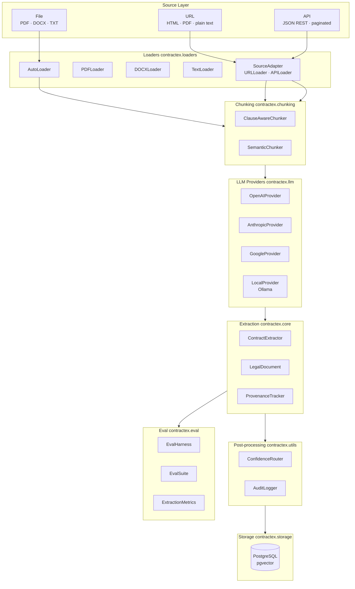

---

## Module map

```text
contractex/
├── loaders/
│   ├── base.py              # DocumentLoader ABC
│   ├── auto.py              # AutoLoader — extension-based dispatch
│   ├── pdf.py               # PDFLoader  (PyMuPDF)
│   ├── docx.py              # DOCXLoader (python-docx)
│   ├── text.py              # TextLoader (plain text + encoding detection)
│   ├── source_adapter.py    # SourceAdapter · URLLoader · APILoader  ← NEW
│   └── langchain_compat.py  # LangChain adapter
│
├── chunking/
│   ├── base.py              # ChunkingStrategy ABC
│   ├── clause_aware.py      # Splits on legal section boundaries
│   └── semantic.py          # Splits on semantic similarity
│
├── llm/
│   ├── base.py              # LLMProvider ABC
│   ├── openai_provider.py   # GPT-4o
│   ├── anthropic_provider.py# Claude 3.x
│   ├── google_provider.py   # Gemini 2.x
│   └── local_provider.py    # Ollama (Llama, Mistral, Phi …)
│
├── core/
│   ├── models.py            # Contract · Clause · Party · FinancialTerm · RiskFlag
│   ├── legal_document.py    # LegalDocument · DocType · SourceSpan  ← NEW
│   ├── extractors.py        # ContractExtractor (multi-phase orchestrator)
│   ├── analyzers.py         # RiskAnalyzer
│   ├── classifiers.py       # CUADClassifier (41 clause types)
│   ├── extraction_schemas.py# Internal LLM ↔ Pydantic bridging schemas
│   ├── validators.py        # Cross-field validation rules
│   └── ner.py               # LegalNER (spaCy / Blackstone) [optional]
│
├── utils/
│   ├── provenance.py        # ProvenanceTracker · ChunkRecord  ← NEW
│   ├── routing.py           # ConfidenceRouter · ReviewItem · RoutingResult  ← NEW
│   ├── audit.py             # AuditLogger · JSONL/Postgres/Null backends  ← NEW
│   ├── confidence.py        # Overall confidence scoring helpers
│   ├── normalizers.py       # Date · currency · entity normalisation
│   ├── comparators.py       # ContractComparator
│   └── exporters.py         # JSON · CSV · Excel
│
├── eval/                    # ← NEW package
│   ├── cases.py             # EvalCase · EvalSuite (YAML/JSON loader)
│   ├── metrics.py           # FieldResult · CaseResult · ExtractionMetrics
│   └── harness.py           # EvalHarness (extractor-agnostic runner)
│
├── storage/
│   ├── models.py            # Storage-layer Document · Clause · ProcessingLog
│   ├── repository.py        # DocumentRepository · ClauseRepository
│   ├── connection.py        # psycopg2 connection management
│   ├── config.py            # DB config from environment
│   └── schema.sql           # DDL for documents · clauses · processing_log
│
├── taxonomy/
│   ├── cuad.py              # CUAD 41-type taxonomy
│   └── schemas.py           # Taxonomy validation schemas
│
├── prompts/
│   ├── clause_extraction.py
│   ├── financial_extraction.py
│   ├── party_extraction.py
│   └── risk_analysis.py
│
└── exceptions.py            # Typed exception hierarchy
```

---

## Installation

```bash
git clone https://github.com/aahepburn/Contract-Clause-Extractor.git
cd Contract-Clause-Extractor

# Full install (all optional extras)
pip install -e ".[all]"

# Or pick what you need
pip install -e ".[storage]"   # PostgreSQL persistence
pip install -e ".[network]"   # URLLoader / APILoader (requests)
pip install -e ".[eval]"      # EvalHarness (pyyaml)
pip install -e ".[ocr]"       # OCR support for scanned PDFs
pip install -e ".[spacy]"     # Named entity recognition
pip install -e ".[local]"     # Local LLM via Ollama
pip install -e ".[retrieval]" # pgvector + sentence-transformers
```

Configure API keys:

```bash
OPENAI_API_KEY=sk-...
ANTHROPIC_API_KEY=sk-ant-...
GOOGLE_API_KEY=...
```

---

## Quick start

```python
from contractex import extract_contract

contract = extract_contract("contract.pdf")
print(f"Parties: {[p.name for p in contract.parties]}")
print(f"Clauses: {len(contract.clauses)}")
print(f"Risks:   {len(contract.critical_risks)} critical")
contract.to_excel("output.xlsx")
```

---

## Contract extraction pipeline

The `ContractExtractor` runs a three-phase LLM pipeline over any document.

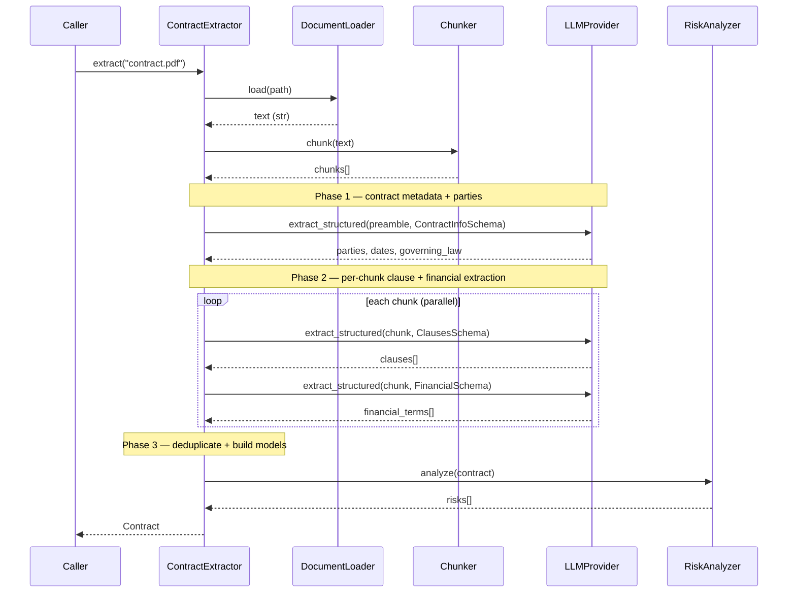

### Custom configuration

```python
from contractex import ContractExtractor
from contractex.llm import AnthropicProvider
from contractex.loaders import PDFLoader
from contractex.chunking import ClauseAwareChunker

extractor = ContractExtractor(
    llm_provider=AnthropicProvider(model="claude-opus-4-6"),
    document_loader=PDFLoader(ocr_enabled=True),
    chunking_strategy=ClauseAwareChunker(max_chunk_size=4000, overlap=200),
    confidence_threshold=0.80,
)

contract = extractor.extract(
    "complex_contract.pdf",
    analyze_risks=True,
    extract_financial=True,
)
```

### Batch processing

```python
contracts = extractor.extract_batch(
    ["msa.pdf", "nda.pdf", "sow.pdf"],
    max_workers=4,
)

# Async variant
import asyncio
contract = asyncio.run(extractor.extract_async("contract.pdf"))
```

### Cost estimation (before extraction)

```python
estimate = extractor.estimate_extraction_cost("long_contract.pdf")
print(f"Estimated cost: ${estimate['estimated_cost']:.4f}")
print(f"Chunks: {estimate['num_chunks']}")
```

---

## General legal document pipeline

`LegalDocument` generalises beyond contracts to any legal document: statutes, regulations, case opinions, identity documents, government forms.

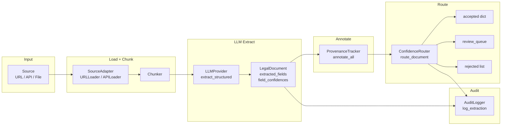

### Example — statute extraction

```python
from contractex.loaders import URLLoader
from contractex.core.legal_document import LegalDocument, DocType, LegalDocumentMetadata
from contractex.utils.provenance import ProvenanceTracker
from contractex.utils.routing import ConfidenceRouter
from contractex.utils.audit import AuditLogger
from contractex.chunking import ClauseAwareChunker
from contractex.llm import OpenAIProvider

url = "https://www.law.cornell.edu/uscode/text/17/107"

# 1. Fetch
loader = URLLoader()
fetch = loader.fetch(url)

# 2. Chunk + register provenance
chunker = ClauseAwareChunker()
chunks = chunker.chunk(fetch.content)

tracker = ProvenanceTracker(source_url=url)
tracker.register_chunks(chunks)

# 3. LLM extraction
llm = OpenAIProvider(model="gpt-4o")
# ... call llm.extract_structured(prompt, YourSchema) ...

# 4. Build LegalDocument
doc = LegalDocument(
    doc_type=DocType.STATUTE,
    jurisdiction="US-Federal",
    citation="17 U.S.C. § 107",
    metadata=LegalDocumentMetadata(
        source_url=url,
        content_hash=fetch.content_hash,
    ),
)
doc.set_field("title", "Fair Use", confidence=0.99)
doc.set_field("effective_date", "1976-10-19", confidence=0.95)

# 5. Annotate provenance
tracker.annotate_all(doc)
print(f"Provenance coverage: {doc.provenance_coverage:.0%}")

# 6. Route + audit
router = ConfidenceRouter(accept_threshold=0.85)
result = router.route_document(doc)

with AuditLogger.from_jsonl("audit/pipeline.jsonl") as audit:
    audit.log_extraction(
        doc.doc_id or "statute-107",
        fields_extracted=list(result.accepted),
        fields_rejected=result.rejected_field_names,
        overall_confidence=sum(doc.field_confidences.values()) / len(doc.field_confidences),
    )
    if result.needs_review:
        audit.log_review_request(
            doc.doc_id or "statute-107",
            fields=result.review_field_names,
        )
```

---

## Network loaders

`SourceAdapter` extends `DocumentLoader` with HTTP fetching, ETag-based change detection, and exponential-backoff retry.

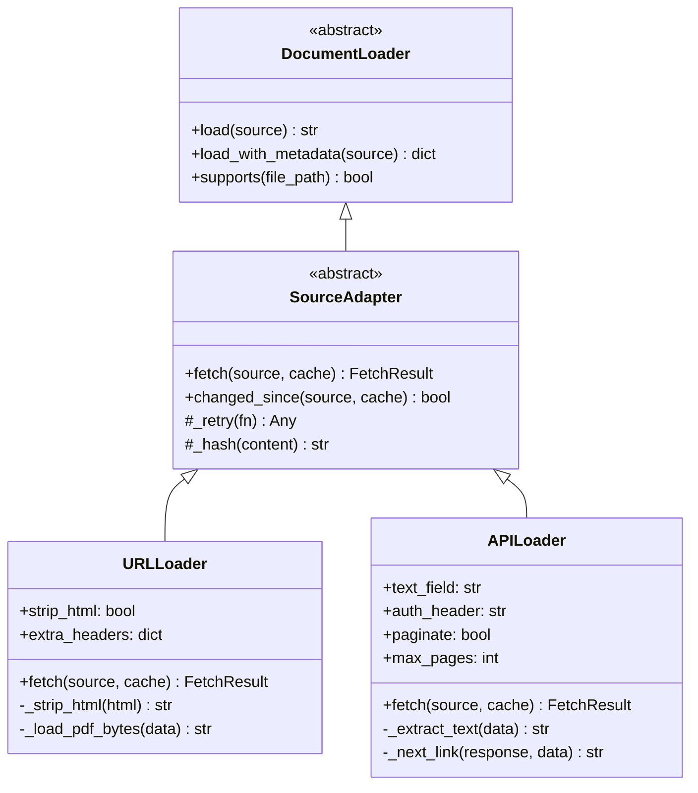

### URLLoader

```python
from contractex.loaders import URLLoader, FetchCache

loader = URLLoader(
    timeout=30,
    max_retries=3,
    strip_html=True,
    headers={"Accept-Language": "en-US"},
)

# First fetch — captures ETag for next time
result = loader.fetch("https://ecfr.gov/current/title-17/section-107")
cache = result.to_cache()

# Next day — conditional GET; returns changed=False if nothing changed
if loader.changed_since("https://ecfr.gov/current/title-17/section-107", cache):
    result = loader.fetch("https://ecfr.gov/current/title-17/section-107")
    # process new content ...
```

### APILoader

```python
from contractex.loaders import APILoader

# CourtListener REST API example
loader = APILoader(
    text_field="plain_text",
    auth_header="Token your-api-key",
    params={"jurisdiction": "scotus"},
    paginate=True,
    max_pages=5,
)

result = loader.fetch("https://www.courtlistener.com/api/rest/v3/opinions/")
print(result.content[:500])
```

---

## Provenance tracking

`ProvenanceTracker` maps every extracted field back to the exact chunk — and character offsets within it — that it came from.

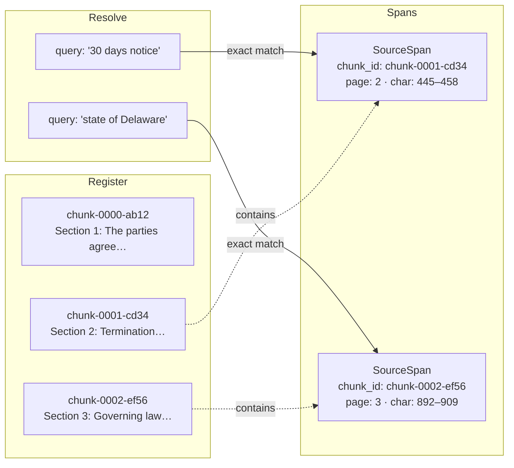

```python
from contractex.utils.provenance import ProvenanceTracker

tracker = ProvenanceTracker(source_url="https://example.com/doc.pdf")
tracker.register_chunks(chunks, page_map={0: 1, 1: 2, 2: 3})

# After LLM extraction places a value in doc.extracted_fields:
tracker.annotate_all(doc)

# Inspect coverage
stats = tracker.coverage(doc)
print(f"Provenance coverage: {stats['coverage_ratio']:.0%}")

# Resolve a single value manually
span = tracker.find_span("thirty days notice")
if span:
    print(f"Found at page {span.page}, chars {span.char_start}–{span.char_end}")
```

---

## Confidence routing

`ConfidenceRouter` partitions extracted fields into three queues based on per-field confidence scores. Per-field threshold overrides support stricter rules for high-stakes fields.

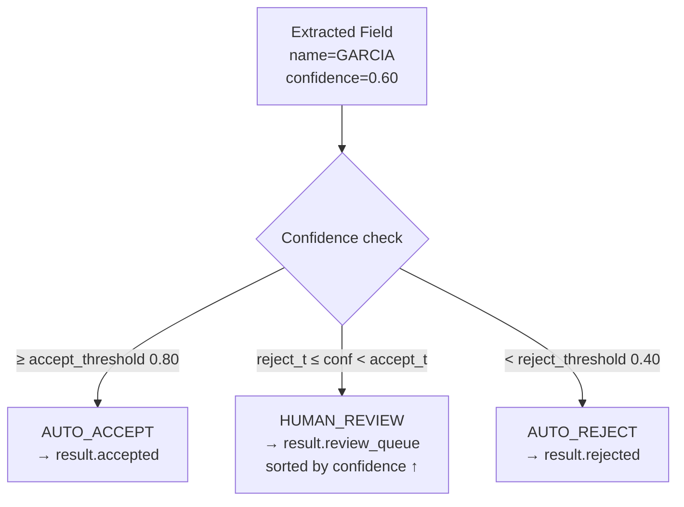

```python
from contractex.utils.routing import ConfidenceRouter

router = ConfidenceRouter(
    accept_threshold=0.80,
    reject_threshold=0.40,
    # Tighter rules for high-stakes fields
    field_thresholds={
        "passport_number": (0.95, 0.70),
        "date_of_birth":   (0.90, 0.60),
    },
)

result = router.route_document(doc)

print(f"Accepted: {list(result.accepted)}")
print(f"Review:   {result.review_field_names}")  # sorted least-confident first
print(f"Rejected: {result.rejected_field_names}")
print(result.summary())
# → RoutingResult(accepted=4, review=2, rejected=1, acceptance_rate=57%)

# Route a plain dict (pre-LegalDocument pipelines)
result = router.route_dict(
    fields={"name": "SMITH", "dob": "1990-01-15"},
    confidences={"name": 0.95, "dob": 0.55},
)
```

---

## Audit logging

`AuditLogger` records every material pipeline operation to an append-only, structured log — satisfying GDPR Article 30 record-of-processing requirements.

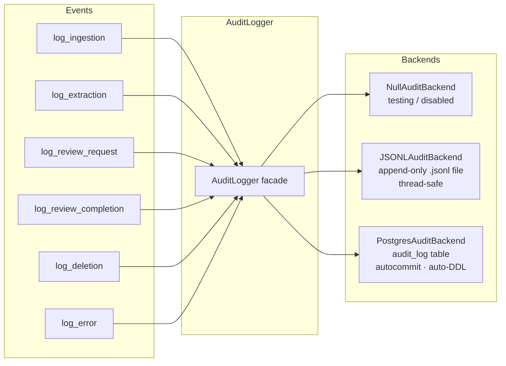

```python
from contractex.utils.audit import AuditLogger

# File-backed (single machine)
with AuditLogger.from_jsonl("audit/pipeline.jsonl") as audit:
    audit.log_ingestion("doc-123", source_url="https://ecfr.gov/...")
    # ... run pipeline ...
    audit.log_extraction(
        "doc-123",
        fields_extracted=["title", "effective_date"],
        fields_rejected=["amendment_date"],
        overall_confidence=0.91,
    )
    if needs_human_review:
        audit.log_review_request("doc-123", fields=["amendment_date"])

# GDPR deletion
audit.log_deletion("doc-123", user_id="gdpr-request-456")

# Postgres-backed (multi-worker)
audit = AuditLogger.from_postgres("postgresql://user:pw@host/db")
```

**Events are never lost on backend failure** — write errors are captured and re-emitted via the standard `logging` module, never raised to the caller.

---

## Eval harness

`EvalHarness` runs labeled test suites against any extraction callable and produces quality metrics with pytest-compatible assertion helpers.

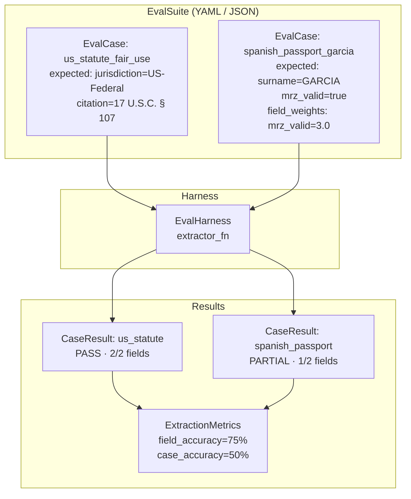

### Suite file (YAML)

```yaml
# tests/eval/immigration_cases.yaml
- id: spanish_passport_garcia
  description: "Sample Spanish passport"
  doc_type: identity_doc
  input_path: tests/fixtures/passport_sample.pdf
  expected_fields:
    surname: GARCIA
    given_name: JOSE
    nationality: ESP
    mrz_valid: true
  field_weights:
    mrz_valid: 3.0   # MRZ validity is load-bearing — weight it higher
  tags: [passport, spanish, immigration]

- id: us_statute_fair_use
  doc_type: statute
  input_text: "Notwithstanding the provisions of sections 106 and 106A ..."
  expected_fields:
    jurisdiction: US-Federal
    citation: "17 U.S.C. § 107"
  tags: [statute, copyright]
```

### Running the harness

```python
from contractex.eval import EvalHarness, EvalSuite

suite = EvalSuite.load("tests/eval/immigration_cases.yaml")

# Wire in your extraction pipeline
def my_extractor(case):
    doc = pipeline.process(case.input_path or case.input_text)
    return doc.extracted_fields

harness = EvalHarness(extractor_fn=my_extractor)
metrics = harness.run(suite)

print(metrics.report())
# ══════════════════════════════════════════════════════════════
#   ContractEx Eval Report
# ══════════════════════════════════════════════════════════════
#   Suite size:     2 cases
#   Passed:         1 (50.0% case accuracy)
#   Errors:         0
#   Field accuracy: 75.0% (weighted)
#   ...

# CI gate (raises AssertionError with full report on failure)
metrics.assert_min_field_accuracy(0.90)
```

---

## Storage layer

The storage layer persists documents, extracted clauses, and processing logs in PostgreSQL.

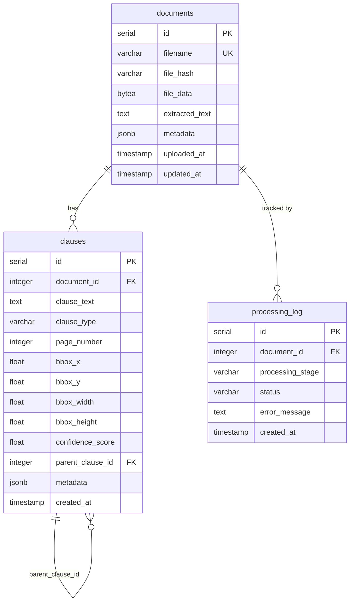

```python
from contractex.storage import DocumentRepository, ClauseRepository, Document

doc = Document(
    filename="contract.pdf",
    file_hash=Document.compute_hash(pdf_bytes),
    file_data=pdf_bytes,
    extracted_text=text,
    metadata={"contract_type": "NDA"},
)
repo = DocumentRepository()
doc_id = repo.insert(doc)
```

Enable vector search by running the embeddings migration:

```bash
psql clause_docs < contractex/storage/migrations/add_embeddings.sql
```

See [CLAUSE_RETRIEVAL_GUIDE.md](CLAUSE_RETRIEVAL_GUIDE.md) for the full hybrid search implementation guide.

---

## LLM providers

All providers implement the same `LLMProvider` ABC so they are interchangeable.

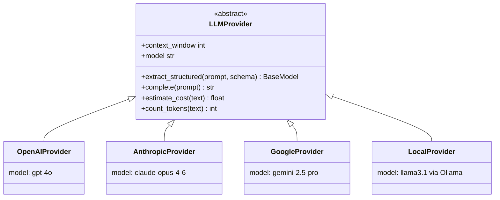

| Provider | Recommended model | Cost/contract | Best for |
| --- | --- | --- | --- |
| OpenAI | `gpt-4o` | ~$0.025 | Highest accuracy |
| Anthropic | `claude-opus-4-6` | ~$0.030 | Long documents |
| Google | `gemini-2.5-pro` | ~$0.002 | Speed + cost |
| Local | any Ollama model | $0 | Privacy / offline |

```python
from contractex.llm import OpenAIProvider, AnthropicProvider, GoogleProvider, LocalProvider

llm = OpenAIProvider(model="gpt-4o", temperature=0.0)
llm = AnthropicProvider(model="claude-opus-4-6")
llm = GoogleProvider(model="gemini-2.5-pro")
llm = LocalProvider(model="llama3.1:8b")  # requires Ollama running locally
```

---

## Examples

| File | What it shows |
| --- | --- |
| [examples/basic_extraction.py](examples/basic_extraction.py) | One-line contract extraction |
| [examples/advanced_extraction.py](examples/advanced_extraction.py) | Custom LLM + chunker config |
| [examples/batch_processing.py](examples/batch_processing.py) | Parallel extraction over many documents |
| [examples/fastapi_service.py](examples/fastapi_service.py) | REST API wrapper |
| [examples/storage_example.py](examples/storage_example.py) | PostgreSQL persistence |
| [examples/ner_example.py](examples/ner_example.py) | Named entity recognition |
| [examples/local_llm_example.py](examples/local_llm_example.py) | Offline extraction with Ollama |
| [examples/langchain_integration.py](examples/langchain_integration.py) | LangChain compatibility |
| [examples/dataset_loading.py](examples/dataset_loading.py) | CUAD / ACORD / LePaRD datasets |

---

## Development

```bash
# Run all unit tests (no database required)
python -m pytest tests/ -m "not integration" --no-cov -v

# Run with coverage
python -m pytest --cov=contractex --cov-report=html

# Code quality
black contractex/
ruff check contractex/ --fix
mypy contractex/
```

Optional extras for development:

```bash
pip install -e ".[dev]"       # pytest, black, ruff, mypy, coverage
pip install -e ".[eval]"      # pyyaml for YAML eval suites
pip install -e ".[network]"   # requests for URLLoader / APILoader
```

---

## License

Apache 2.0 — see [LICENSE](LICENSE) for details.
